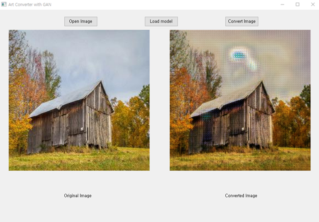

# Art_GAN

---
This is GUI program for Style Transfer with CycleGAN

---
## Made by..
- Pytorch
- PyQt5

## Result

## How to Use
### install
<code> pip install -r requirements.txt </code>

### run
<code> python Art_GUI.py</code>

## Plan
- Model improvements

## Reference
- CycleGAN : <a>https://github.com/junyanz/pytorch-CycleGAN-and-pix2pix

